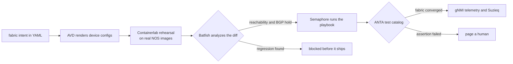

# Packets to Pixels 🚢

 

**A shiplist for every layer between the wire and the screen.**

Most engineers pick a layer and stay there, less from lack of curiosity than from never being handed a map of the rest. This is that map, traced bottom-up: compute and storage, the network, containers and pipelines, APIs and data, and finally the pixels users touch. Full stack here means the whole stack, not frontend plus an API.

Written for engineers choosing production defaults across infrastructure, networking, delivery, and application layers, this is a decision guide rather than a setup manual or exhaustive catalog.

The platform behind this list is real, deployed, and self-hosted. Every verdict comes from operating the tool or pattern it recommends; any gap between the deployed state and the target design is named explicitly.

- Around 40 virtual machines, with roughly two thirds running at any moment, on a quarter terabyte of RAM and more than 11 terabytes of usable hardware-RAID storage.
- A BGP underlay with an EVPN overlay and a 20-node Arista cEOS fabric stood up and torn down per lab.
- A k3s cluster, close to 200 running containers, and 22 application repositories deployed on the platform.
- Private PKI, SSO, SIEM, metrics, logs, backups, and client-side-encrypted restic snapshots, with the off-site gap documented in [Backup and Recovery](#backup-and-recovery).

Nothing here is on the list because it trended. Every category is curated down to the tools worth your evaluation time and begins with a current default plus the operating reason behind it. That format is the brand: this is a shiplist, not an inventory.

How to read this list:

- Every operational tool entry has been deployed on the platform or in at least one of its 22 applications. Deployment proves operating experience, not permanent endorsement.
- 🚢 **Ship it** marks the current default. An entry that names the situation where it wins is a deployed alternative; every other entry is part of the stack that makes the verdict real.
- A few sections are toolkits or reading lists rather than choices and carry no verdict. Naming one default there would be dishonest.
- Counts such as *ships in 18 of 22* come from the dependency trees of the 22 applications. They appear only in the application tiers; the layers below argue from operating the platform end to end.
- 💲 marks a paid resource whose operational value justified the cost.

## Contents

- [Two Pipelines, One Discipline](#two-pipelines-one-discipline)
    - [Commit to Container](#commit-to-container)
    - [Intent to Fabric](#intent-to-fabric)
    - [The Same Stations, Different Nouns](#the-same-stations-different-nouns)
    - [What the Diagrams Do Not Show](#what-the-diagrams-do-not-show)
- [Compute and Storage](#compute-and-storage)
    - [Compute and Virtualization](#compute-and-virtualization)
    - [Storage](#storage)
- [The Network](#the-network)
    - [Network as Code](#network-as-code)
    - [Fabric Automation and Validation](#fabric-automation-and-validation)
    - [Network Telemetry and Observability](#network-telemetry-and-observability)
    - [Packet-Level Troubleshooting](#packet-level-troubleshooting)
    - [Network Services](#network-services)
    - [Wireless and RF](#wireless-and-rf)
- [Containers and Delivery](#containers-and-delivery)
    - [Containers](#containers)
    - [Kubernetes and GitOps](#kubernetes-and-gitops)
    - [Infrastructure and Delivery](#infrastructure-and-delivery)
    - [Registries and Build Caches](#registries-and-build-caches)
    - [CI/CD](#cicd)
- [Automation and Orchestration](#automation-and-orchestration)
- [Security and Identity](#security-and-identity)
    - [Identity and Secrets](#identity-and-secrets)
    - [Certificates and PKI](#certificates-and-pki)
    - [Detection and Response](#detection-and-response)
- [Observability](#observability)
    - [Metrics and Alerting](#metrics-and-alerting)
    - [Logs, Traces and APM](#logs-traces-and-apm)
- [Backup and Recovery](#backup-and-recovery)
- [The Backend](#the-backend)
    - [APIs and Services](#apis-and-services)
    - [Data and Persistence](#data-and-persistence)
    - [AI Integration](#ai-integration)
- [The Frontend](#the-frontend)
    - [React and TypeScript](#react-and-typescript)
    - [Build Tooling and Frameworks](#build-tooling-and-frameworks)
    - [Application State](#application-state)
    - [Styling, Components, and Motion](#styling-components-and-motion)
    - [Charts and Visualization](#charts-and-visualization)
    - [Utilities That Earn Their Keep](#utilities-that-earn-their-keep)
    - [Content and Documents](#content-and-documents)
- [Design and UX](#design-and-ux)
    - [Design Foundations](#design-foundations)
    - [Accessibility](#accessibility)
    - [Design and UX Reading](#design-and-ux-reading)
- [Quality](#quality)
    - [Testing](#testing)
    - [Developer Tools](#developer-tools)
- [Self-Hosted Applications](#self-hosted-applications)
- [Contributing](#contributing)
- [Credits and License](#credits-and-license)

## Two Pipelines, One Discipline

The shiplist that follows makes a choice at each layer. These two pipelines show how those choices work together as a system.

A commit changes production whether it produces a container image or a switch configuration. Both deserve the same discipline: intent in version control, validation before deployment, proof afterward, and steady-state monitoring. The pipelines use the same seven stations with different nouns; every tool they name appears in the shiplist below.

### Commit to Container

```mermaid
flowchart LR
  push["git push"] --> forge["self-hosted git host"]
  forge --> runner["Actions runner"]
  runner --> lint["lint and type-check"]
  lint --> test["unit and E2E tests"]
  test --> secrets["secret scan"]
  secrets --> build["multi-stage image build"]
  build --> reg[("private registry<br/>candidate tagged by commit")]
  reg --> scan{"scan exact digest"}
  scan -->|"policy passes"| pin["PaaS image reference<br/>pinned to digest"]
  scan -->|"policy fails"| blockedimage["blocked before deploy"]
  pin --> paas["PaaS pulls and swaps<br/>the exact image"]
  paas --> proxy["reverse proxy<br/>TLS from the private CA"]
  proxy --> probe{"content probe"}
  probe -->|"body matches"| shipped["shipped"]
  probe -->|"no match"| page["page a human"]
```

A push reaches a git host you run, and a runner you own picks it up. That is the rule the rest of the diagram keeps: own everything between the push and the page. Gates run before the artifact exists, ordered so cheap failures stop expensive work.

Only then does the runner build a commit-tagged image and push it to the private registry, which assigns the immutable digest the scanner evaluates. A passing gate updates the PaaS to that digest; a failed gate leaves production untouched. The registry also fronts the public one as a pull-through cache, so a warm rebuild survives an upstream outage.

The PaaS swaps in the approved image, the proxy terminates TLS with an automatically renewed certificate from the internal CA, and an external content probe checks the expected response. The digest proves artifact identity; the probe checks the deployed path.

### Intent to Fabric

The fabric is described once in YAML and rendered rather than typed. Before deployment, the topology runs on real network OS images and Batfish analyzes the proposed configs for reachability and BGP regressions. A scheduler runs the playbook with logs and an audit trail, ANTA tests convergence, and streaming telemetry plus Suzieq establish the measured state for the next change.

### The Same Stations, Different Nouns

- **Source of truth** is an application repo, or a fabric intent repo. Neither is a device, and neither is a person's memory.
- **Rendering** is a Dockerfile and a bundler, or AVD templates. Both turn a short description into a long artifact nobody should hand-edit.
- **Rehearsal** is running it locally or on a preview environment, or standing up the topology in Containerlab. This is the station most teams skip on both sides.
- **Pre-deploy gate** is tests plus secret and image scanning, or Batfish. Both answer "does this diff break something" before the diff can.
- **Deploy** is the PaaS pulling an approved image digest, or Ansible pushing configs through a scheduler. Both are boring on purpose.
- **Post-deploy proof** is a content probe, or an ANTA catalog. Both exist because "it deployed" is not "it works".
- **Steady-state watch** is Prometheus and an external prober, or gNMI telemetry and Suzieq. Both require a tested notification path.

### What the Diagrams Do Not Show

The arrows are the easy part. These are the failures that cost real evenings, and every one of them looks like success from the outside.

- **Build-time and runtime environment variables are different things.** A frontend bundler inlines its variables at build time, so runtime injection arrives too late. If the build reads the value, pass it as a build argument.
- **A managed platform will assume port 22.** Point a PaaS at a self-hosted git host listening on a different SSH port and the clone silently targets the wrong one. Put the port in the URL itself and create the app through the deploy-key endpoint, not the one-click one, because that is the path that rewrites the URL.
- **A variable can be set and still not injected.** Scope it to preview when it was meant for production and the API will cheerfully list it as configured while the production container starts without it. The config looks right and the app crash-loops. Read the scope, not just the key.
- **A private CA has to be trusted inside the container.** Trusting the root on the host proves nothing about the process making the call. A service that reaches an internal endpoint over TLS needs the root in its own trust store, in its own image.
- **A platform that builds from git builds its own artifact.** The gates certify the commit, and then the PaaS creates a second image rather than running the one the pipeline scanned. The two agree until a base image moves or a cache diverges. The digest path above closes that gap; any Git-source deployment that still rebuilds remains a documented exception whose gates certify source, not the running artifact.
- **Verify by content, never by status.** This is the same rule the content probe and the ANTA catalog encode, and it is one of the highest-value habits on this page. `finished` means a process exited zero. It does not mean the page renders, the API answers, or the fabric converged.

## Compute and Storage

Where the stack actually starts: out-of-band management, the hypervisor layer that turns physical capacity into schedulable compute, and the storage everything above ultimately lands on.

### Compute and Virtualization

> 🚢 **Ship it: whatever hypervisor you already have, driven as code.** The platform runs ESXi through [govmomi](https://github.com/vmware/govmomi), [Terraform](https://github.com/hashicorp/terraform), and [cloud-init](https://github.com/canonical/cloud-init). The brand matters less than a definition that can rebuild a VM, expose contention, and distinguish an outage from deliberately parked capacity.

- [govmomi](https://github.com/vmware/govmomi) - VMware's vSphere driven from code: the Go client library and its `govc` CLI give the full VM lifecycle from a shell script, with no vCenter clicking.
- [Terraform](https://github.com/hashicorp/terraform) - Declarative infrastructure with state that makes drift visible. It turns having virtual machines into being able to recreate them, hypervisors included.
- [terraform-provider-esxi](https://github.com/josenk/terraform-provider-esxi) - The deployed community provider supports `clone_from_vm` directly against standalone ESXi through SSH and VMware OVF Tool. The official vSphere provider can connect to standalone ESXi, but [v2.15.2 removed vSphere 7.x from its documented support list](https://github.com/vmware/terraform-provider-vsphere/releases/tag/v2.15.2); this narrower provider matches the platform's proven clone workflow.
- [cloud-init](https://github.com/canonical/cloud-init) - First-boot provisioning: users, keys, packages, and config declared once, identical on every VM and cloud.
- [Prometheus Python client](https://github.com/prometheus/client_python) - Exposes management-controller thermal, power, and drive state as metrics. Roughly a hundred lines turn an out-of-band API into a scrape target that remains available when the host does not.

### Storage

> 🚢 **Ship it: a deliberately boring storage tier, measured before it is trusted.** Put hardware RAID under the hypervisor, export shared data over NFS, and keep the copies themselves in [Backup and Recovery](#backup-and-recovery), because RAID is availability and not backup. Check the controller's cache policy rather than treating a healthy status as proof of tuned I/O.

The array behind this list exposed why: its cache was set to 100 percent read, so writes bypassed it while every health indicator stayed green, `Cache Status: OK` included. Sequential writes measured **1.3 MB/s** at 54 percent host iowait. Changing the split to 25/75, online and reversible, took the same test to **295 MB/s**.

- [ssacli](https://support.hpe.com/connect/s/softwaredetails?language=en_US&collectionId=MTX-2c5b4bd7bad441a5) - The RAID controller CLI exposes cache policy that the management API and hypervisor dashboards do not. Install the equivalent for the controller before it is needed; on supported hypervisors it can typically be added without a reboot or maintenance window.

## The Network

The layers under everything. Networks deserve the same rigor as application code: version control, validation before deploy, tests after.

### Network as Code

> 🚢 **Ship it: [Containerlab](https://github.com/srl-labs/containerlab)**. Real network OS images wired from one topology file turn belief about a BGP change into observed convergence. Keep each lab self-contained, deploy it on demand, and reap it on a timer so rehearsal does not compete with production.

- [containerlab](https://github.com/srl-labs/containerlab) - Declarative container-based network labs. The fastest way to rehearse a change against real NOS images.
- [clab-api-server](https://github.com/srl-labs/clab-api-server) - A REST API in front of Containerlab, so labs can be deployed by a pipeline or a dashboard instead of an SSH session.
- [clabernetes](https://github.com/clabernetes/clabernetes) - Containerlab topologies scheduled across a Kubernetes cluster, for when a lab outgrows one host's RAM.
- [netbox](https://github.com/netbox-community/netbox) - The source of intended state for devices, IPs, and VLANs. Network changes begin here and automation carries them outward; when observed state disagrees, open a drift investigation before changing either side.
- [netbox-sync](https://github.com/bb-Ricardo/netbox-sync) - Imports observed hypervisor inventory into NetBox. Treat it as discovery for fields the hypervisor owns; do not let observed power state overwrite intended lifecycle status.
- [oxidized](https://github.com/ytti/oxidized) - Polls every device on a schedule and commits the running config to git. Config drift becomes a reviewable diff, and "what changed before the outage" becomes a `git log`.

### Fabric Automation and Validation

> 🚢 **Ship it: [AVD](https://github.com/aristanetworks/avd) for intent, [Batfish](https://github.com/batfish/batfish) as the pre-deploy gate, [ANTA](https://github.com/aristanetworks/anta) as the post-deploy gate.** Describe the fabric once in YAML, render device configs, analyze reachability and BGP before the push, and prove convergence afterwards. Batfish belongs against the proposed diff; ANTA belongs against the live fabric.

A pre-deploy gate wired into the git host's CI fires on every change without anybody deciding to run it. A post-deploy gate left as a script covers only the changes somebody remembered to check. That asymmetry, not the tool names, decides whether the gate is real.

- [avd](https://github.com/aristanetworks/avd) - Arista Validated Designs: entire EVPN/VXLAN fabrics generated from YAML intent via Ansible, with documentation rendered from the same source.
- [batfish](https://github.com/batfish/batfish) - Pre-deploy config analysis. Finds the outage in the diff before the diff finds production.
- [anta](https://github.com/aristanetworks/anta) - Post-deploy network validation as declarative test catalogs: prove the fabric converged, in CI. A baseline catalog plus a per-lab catalog covers both "is this fabric healthy" and "did this design do what it claimed".

### Network Telemetry and Observability

> 🚢 **Ship it: streaming telemetry over polling.** gNMI subscriptions through [Telegraf](https://github.com/influxdata/telegraf) into Prometheus provide fabric state from every node without repeatedly polling the control plane. Put [Suzieq](https://github.com/netenglabs/suzieq) beside it for historical state questions across the fabric.

- [suzieq](https://github.com/netenglabs/suzieq) - Network observability: poll the fabric, then query its state like a database, across time.
- [telegraf](https://github.com/influxdata/telegraf) - The collector with a gNMI input and a Prometheus output. One agent between the fabric and the metrics store.
- [snmp_exporter](https://github.com/prometheus/snmp_exporter) - SNMP translated into Prometheus metrics, for every device that will never speak gNMI. Most estates need both.
- [ntopng](https://github.com/ntop/ntopng) - Flow-level traffic analysis from sFlow or a mirror port: who is talking to whom, and how much.
- [blackbox_exporter](https://github.com/prometheus/blackbox_exporter) - Synthetic ICMP, TCP, and HTTP probes. It measures reachability from outside the service rather than trusting the service's own status.

### Packet-Level Troubleshooting

> 🚢 **Ship it: [Wireshark](https://github.com/wireshark/wireshark), and `tcpdump` on the far end of the SSH session.** Every dashboard higher up this page is a summary of what these two see directly. When the graph and the application disagree, the capture is the tiebreaker, and knowing how to read one is the skill that does not go out of date.

- [wireshark](https://github.com/wireshark/wireshark) - The protocol analyzer, and `tshark` for the same dissectors in a pipeline.
- [tcpdump](https://github.com/the-tcpdump-group/tcpdump) - Capture where the traffic is. A tight BPF filter is the difference between evidence and a 4 GB file.
- [iperf](https://github.com/esnet/iperf) - Throughput measured rather than assumed, which usually ends the argument about whose layer is slow.
- [mtr](https://github.com/traviscross/mtr) - Continuous traceroute with loss per hop. Finds the one link that is dropping a few percent.
- [nmap](https://github.com/nmap/nmap) - Host and service discovery, and the fastest sanity check that a firewall rule does what the ticket said.

### Network Services

> 🚢 **Ship it: [pfSense](https://github.com/pfsense/pfsense)** at the edge, **[AdGuard Home](https://github.com/AdguardTeam/AdGuardHome)** for DNS. The deployed pfSense API package and AdGuard API turn firewall rules and DNS records into automation targets. Run a second resolver before it is needed; DNS can disable an otherwise healthy network.

- [pfSense](https://github.com/pfsense/pfsense) - The proven open-source firewall and router: routing, DHCP, VLANs, and policy. The platform adds the community [pfSense REST API package](https://github.com/pfrest/pfSense-pkg-RESTAPI) so automation can manage those objects; the package is not native or supported by Netgate.
- [opnsense](https://github.com/opnsense/core) - The other descendant of the same BSD firewall lineage, with a faster release cadence and a more modern UI. Pick it when frequent updates and plugin freshness outweigh pfSense's larger installed base.
- [adguard-home](https://github.com/AdguardTeam/AdGuardHome) - Network-wide DNS with filtering, rewrites, and split-DNS for internal domains.
- [Tailscale](https://github.com/tailscale/tailscale) - WireGuard mesh with authorized devices reachable without port forwarding or a VPN concentrator.
- [wireguard](https://github.com/WireGuard/wireguard-linux) - The modern VPN protocol itself, for when you want the mesh without the coordination service.

### Wireless and RF

> 🚢 **Ship it: measured coverage, not assumed coverage.** For a home, small office, or compact platform, [wifi-heatmapper](https://github.com/hnykda/wifi-heatmapper) turns signal and throughput samples into a repeatable baseline. The medium is shared, the client makes the roaming decision, and every higher layer inherits the resulting RF behavior.

- [wifi-heatmapper](https://github.com/hnykda/wifi-heatmapper) - Records laptop signal strength and optional iperf3 throughput at points on a floor plan. Use it for repeatable small-site validation; it is not a predictive survey or calibrated spectrum analysis, so dense or business-critical deployments still need survey tooling.
- 💲 [Arista CV-CUE](https://www.arista.com/en/products/cloudvision-cue/cv-cue) - Cloud-managed Wi-Fi with centralized configuration, RF visualization, client journey telemetry, active assurance, WIPS, and APIs. Pick it when operating managed APs and troubleshooting clients over time justify a licensed platform; it complements an on-site walk-through rather than replacing one.

## Containers and Delivery

From a reproducible image to a container serving traffic, the delivery path should run without human babysitting. Own everything between the push and the page: the git host, runner, and PaaS keep the path from commit to production on controlled hardware, without CI minutes or seat pricing.

### Containers

> 🚢 **Ship it: a multi-stage Dockerfile in every repo.** Build with the heavy toolchain, ship the small runtime image, and keep secrets out of layers. Pin base images by digest, then compare the declared digest with what is running so a file change cannot masquerade as a deployment.

- [Moby](https://github.com/moby/moby) - The container engine underneath the delivery chain.
- [BuildKit](https://github.com/moby/buildkit) - Parallel stages, cache mounts, and build secrets that never land in an image layer.
- [Docker Compose](https://github.com/docker/compose) - Multi-container applications in one file. Below orchestrator scale it is the default, not a fallback.

### Kubernetes and GitOps

> 🚢 **Ship it: [k3s](https://github.com/k3s-io/k3s) + [Argo CD](https://github.com/argoproj/argo-cd)** when desired state must live in git and reconcile itself, and a PaaS otherwise. Kubernetes earns its complexity through scheduling, self-healing, and drift reconciliation. Enable Cilium's CNI, kube-proxy replacement, Hubble, load-balancer IPAM, and BGP control plane deliberately; they are separate capabilities.

- [k3s](https://github.com/k3s-io/k3s) - Conformant Kubernetes in one binary. The honest on-ramp: small enough to run on your own hardware, real enough to transfer.
- [argo-cd](https://github.com/argoproj/argo-cd) - GitOps reconciliation: the cluster converges on what the repo says, and a manual `kubectl edit` shows up as drift instead of a mystery.
- [Cilium](https://github.com/cilium/cilium) - eBPF networking, policy, and load balancing. With the relevant features enabled, it can replace kube-proxy, allocate service addresses, and advertise those VIPs through BGP; each capability needs explicit validation.
- [hubble](https://github.com/cilium/hubble) - The flow visibility layer over Cilium: pod-to-pod traffic in real time, which no SPAN port can see.
- [helm](https://github.com/helm/helm) - The package format the ecosystem ships in. Whatever you template with, you will be consuming charts.
- [headlamp](https://github.com/kubernetes-sigs/headlamp) - A clean web UI when the person looking does not live in a terminal. Wire it to OIDC so the cluster authorizes the human, not the dashboard's service account.
- [kube-state-metrics](https://github.com/kubernetes/kube-state-metrics) - Cluster object state as Prometheus metrics. The source for "how long has that deployment been degraded".

### Infrastructure and Delivery

> 🚢 **Ship it: [Coolify](https://github.com/coollabsio/coolify)** on controlled hardware. When CI builds the image, scan its registry digest and update Coolify to that exact digest only after the gate passes. Coolify owns the runtime swap; the post-deploy probe checks the critical path.

Git-source deployments make Coolify rebuild the commit, so their gates certify source rather than the second artifact that runs. Migrate them when artifact identity matters. Under the digest path, rollback repoints the application at a retained digest, making registry retention part of recovery. Cloud Run remains the alternative when an application needs a managed public edge.

- [coolify](https://github.com/coollabsio/coolify) - Self-hosted PaaS: git-push deploys, env management, and per-app containers without writing your own pipeline.
- [traefik](https://github.com/traefik/traefik) - The reverse proxy that discovers containers on its own, with a file provider for the routes that are not containers. One ingress, automatic routing, TLS termination.

### Registries and Build Caches

> 🚢 **Ship it: a pull-through cache for every upstream you depend on.** Mirror container, npm, and OS packages so warm builds become local reads. A cold cache still calls upstream, so the gain is speed and rate-limit headroom rather than true offline operation. Only proxy caches are disposable; a registry holding first-party images still needs retention and a recovery path.

- [distribution](https://github.com/distribution/distribution) - The reference registry. Run one instance to hold your own images and a second in proxy mode as the upstream mirror, because a single process does not do both jobs.
- [verdaccio](https://github.com/verdaccio/verdaccio) - A small npm proxy in front of the public registry. Bake its address into the image build as an argument, so an outage gets overridden explicitly instead of silently bypassed.
- [apt-cacher-ng](https://salsa.debian.org/blade/apt-cacher-ng) - Caching proxy for OS packages. A detect hook that answers DIRECT when the cache is unreachable keeps a dead cache from becoming a dead install.

### CI/CD

> 🚢 **Ship it: [Gitea](https://github.com/go-gitea/gitea) with its [built-in Actions](https://docs.gitea.com/usage/actions/overview/)**. Its workflow model is mostly compatible with GitHub Actions while jobs run on your own hardware. End the pipeline with the post-deploy proof defined in [Two Pipelines](#two-pipelines-one-discipline).

- [gitea](https://github.com/go-gitea/gitea) - Self-hosted git hosting with issues, packages, and Actions CI in one binary.
- [Forgejo](https://codeberg.org/forgejo/forgejo) - The community-governed Gitea fork. Pick it when nonprofit governance weighs as much as feature parity.
- [act_runner](https://gitea.com/gitea/runner) - Gitea's Actions runner. One runner container serves every repository you have, and it belongs on its own host so a heavy build never competes with the automation server for CPU.
- [renovate](https://github.com/renovatebot/renovate) - Self-hostable dependency updates as PRs, so version drift becomes reviewable diffs instead of a yearly big-bang upgrade.
- [Trivy](https://github.com/aquasecurity/trivy) - Image, IaC, and secret scanning as a CI gate. Finds leaked credentials before they reach an image or deployment.
- [Gitleaks](https://github.com/gitleaks/gitleaks) - Secret scanning for git history and pre-commit. A token that never enters history never needs rotating.

## Automation and Orchestration

The glue between every layer above and below: reactions wired to events, state pushed by playbooks, and an audit trail for both, because automation nobody can inspect is just an outage with a delay on it.

> 🚢 **Ship it: [n8n](https://github.com/n8n-io/n8n)** for event-driven glue, **[Ansible](https://github.com/ansible/ansible)** for machine state. The rule of thumb: if it reacts to a webhook or a schedule, it is an n8n workflow; if it configures a host, it is a playbook.

- [n8n](https://github.com/n8n-io/n8n) - Self-hostable workflow automation with real code steps when the visual nodes run out. The glue layer between every service on this page.
- [ansible](https://github.com/ansible/ansible) - Declarative configuration management. The playbook is the documentation, and rerunning a well-written playbook is safe, which is the discipline: idempotence is earned in the writing, not granted by the tool.
- [semaphore](https://github.com/semaphoreui/semaphore) - A clean web UI and API over Ansible playbooks: schedules, logs, and an audit trail instead of ad-hoc SSH sessions.

## Security and Identity

Who gets in, what they can reach, and what notices when either answer is wrong: one front door, one secret store, real TLS inside the walls, and telemetry for the events that should never happen.

### Identity and Secrets

> 🚢 **Ship it: [Authentik](https://github.com/goauthentik/authentik)** as the single front door through native SSO or forward auth, **[Vaultwarden](https://github.com/dani-garcia/vaultwarden)** as the secret store humans and scripts share. A credential in a repo or shell history is already leaked.

- [authentik](https://github.com/goauthentik/authentik) - Self-hosted identity provider: OIDC, SAML, and proxy auth in front of apps that have no auth of their own.
- [vaultwarden](https://github.com/dani-garcia/vaultwarden) - The lightweight Bitwarden-compatible server. One vault for people and automation alike.
- [rbw](https://github.com/doy/rbw) - The unofficial Bitwarden CLI lets scripts fetch credentials at runtime instead of reading committed environment files. Fail closed on empty output so a locked vault cannot become an unauthenticated API call.

### Certificates and PKI

> 🚢 **Ship it: [smallstep/certificates](https://github.com/smallstep/certificates)** as the internal ACME CA, **[Cert Warden](https://github.com/gregtwallace/certwarden)** for issuance and renewal. Distribute the root once and issue per-host certificates rather than copying one wildcard key across the platform.

- [smallstep/certificates](https://github.com/smallstep/certificates) - A private ACME CA, so internal services get real, auto-renewed TLS instead of browser warnings.
- [certwarden](https://github.com/gregtwallace/certwarden) - Centralized ACME cert management over that CA: issuance, renewal, and delivery per host, so no service quietly expires.

### Detection and Response

> 🚢 **Ship it: [Wazuh](https://github.com/wazuh/wazuh)** on every host, **[Zeek](https://github.com/zeek/zeek)** on the wire, landing in one place. Host telemetry says what a machine did; wire telemetry says what actually crossed the network; incidents live in the disagreement. Write custom rules for the events that matter on the platform at hand, because a SIEM running only its default ruleset is a log archive with better marketing.

- [wazuh](https://github.com/wazuh/wazuh) - Open-source SIEM and host intrusion detection: an agent on every VM, file integrity monitoring, and custom rules for the events that actually matter. The layer that notices what monitoring cannot.
- [Zeek](https://github.com/zeek/zeek) - Turns observed connections, DNS queries, and TLS handshakes into structured logs. Pair it with Wazuh so wire and host telemetry land together.
- [osquery](https://github.com/osquery/osquery) - Every endpoint as a SQL-queryable table. "Which machines still have that package" becomes a query instead of a project.
- [fleet](https://github.com/fleetdm/fleet) - osquery across every machine at once, with scheduled queries and policy reporting.

## Observability

What the platform is actually doing, measured rather than assumed: metrics from inside, probes from outside, and logs for the questions asked afterwards.

### Metrics and Alerting

> 🚢 **Ship it: two watchers with different jobs.** [Prometheus](https://github.com/prometheus/prometheus) alerts on what the metrics say from inside; [Uptime Kuma](https://github.com/louislam/uptime-kuma) probes from outside with keyword checks, not just pings. One tells you why, the other tells you whether users can tell. And an alert that reaches no human is a log line: give the page a path to a phone.

- [prometheus](https://github.com/prometheus/prometheus) - The metrics backbone: scrape everything, alert on rules, keep the rules unit-tested like code.
- [node_exporter](https://github.com/prometheus/node_exporter) - Host metrics (CPU, disk, memory, filesystem) for every machine. The first exporter on every new VM.
- [cadvisor](https://github.com/google/cadvisor) - Per-container CPU, memory, and I/O. The exporter that answers "which container ate the host".
- [alertmanager](https://github.com/prometheus/alertmanager) - Routing, grouping, and silencing between Prometheus rules and humans. Intent gates belong here: a parked VM that is off on purpose should not page anyone.
- [uptime-kuma](https://github.com/louislam/uptime-kuma) - Self-hosted uptime monitoring with keyword checks and every notification channel that exists.
- [Healthchecks](https://github.com/healthchecks/healthchecks) - Dead-man monitoring for scheduled work. Prometheus and Uptime Kuma watch running services; Healthchecks alerts when a backup, certificate renewal, or configuration sweep stops checking in.
- [ntfy](https://github.com/binwiederhier/ntfy) - Push notifications to your phone over plain HTTP PUT, self-hosted, no vendor. The last mile of every alert path on this page.
- [Grafana](https://github.com/grafana/grafana) - Dashboards over Prometheus and the other stores, provisioned from code. Community dashboards seed common views; custom ones should answer platform-specific capacity, fabric, container, and probe questions.
- [Umami](https://github.com/umami-software/umami) - Privacy-friendly, self-hosted product analytics. It measures what users do; the tools above measure whether the service works.

### Logs, Traces and APM

> 🚢 **Ship it: [Loki](https://github.com/grafana/loki) for logs, [OpenTelemetry](https://github.com/open-telemetry/opentelemetry-collector) for everything you instrument yourself.** Loki indexes labels rather than content, so it stays affordable without a dedicated storage tier, and it sits in the same Grafana pane as the metrics. Emitting OTLP keeps the backend a decision you can change later, which matters more than whichever backend you pick today.

- [loki](https://github.com/grafana/loki) - Log aggregation designed around labels, not full-text indexes. Cheap enough to keep everything.
- [Grafana Alloy](https://github.com/grafana/alloy) - Grafana's supported OpenTelemetry Collector distribution and Loki ingestion agent. It collects logs, metrics, traces, and profiles; migrate existing configurations because [Promtail reached end of life on March 2, 2026](https://grafana.com/docs/loki/latest/send-data/promtail/).
- [Vector](https://github.com/vectordotdev/vector) - Reroutes, filters, and transforms telemetry before storage. Pick it when several backends need the same stream in different shapes.
- [sentry](https://github.com/getsentry/sentry) - The tier none of the three above covers: an exception thrown in someone else's browser, with the stack trace, the release, and the user's path to it attached. Metrics show the request succeeded and the logs show nothing, because the failure happened after the response left.
- [glitchtip](https://gitlab.com/glitchtip/glitchtip-backend) - The self-hosted choice for that Sentry-shaped tier: it accepts the same SDKs and sourcemaps but runs as a smaller Postgres-backed service. Use it for browser errors and unhandled crashes; leave backend traces and RED metrics to SigNoz so one fault does not create two alert paths.
- [signoz](https://github.com/SigNoz/signoz) - Self-hosted APM over OpenTelemetry, and where the traces land: logs and metrics stay in the Grafana pane, the tracing side lives here, and neither tier carries a per-host bill.
- [opentelemetry-collector](https://github.com/open-telemetry/opentelemetry-collector) - Receive, process, and export telemetry in one vendor-neutral hop. Instrument once, change backends later.
- [opentelemetry-js](https://github.com/open-telemetry/opentelemetry-js) - Traces and metrics in the app tier; auto-instrumentations make the first mile nearly free.

## Backup and Recovery

The layer that assumes every other layer will fail. RAID protects hardware; backups protect the state produced across the platform. Nothing here is real until it has survived a restore.

> 🚢 **Ship it: [restic](https://github.com/restic/restic) with scheduled, verified restores.** Build toward a 3-2-1 layout: three copies, two media, and one off-site copy, encrypted before data leaves the host. A backup is not proven until it has restored successfully.

A restore rehearsal exposed a missing environment file: the nightly job completed and verified, but could not reload the database. Restore tests belong on the schedule, not in the incident plan.

**Current gap:** the off-site restic target is configured but disabled. The local repository shares a failure domain with the systems it protects, so the platform does not yet satisfy 3-2-1. This remains its highest-priority recovery gap.

- [restic](https://github.com/restic/restic) - Encrypted, deduplicated snapshots to local disk, SFTP, S3, or B2. One tool covers local and off-site targets.
- [backrest](https://github.com/garethgeorge/backrest) - A web UI and scheduler over restic. Makes repository health and last-successful-run visible instead of a cron job nobody reads.
- 💲 [Backblaze B2](https://www.backblaze.com/cloud-storage) - A low-cost off-site target. Pick it when storage cost matters more than zero-fee retrieval, and budget for egress before a restore is urgent.
- 💲 [Wasabi](https://wasabi.com/pricing/faq) - No per-request or egress fees within its usage policies, balanced by a 90-day minimum storage duration for pay-as-you-go objects. Pick it when restore traffic makes egress cost decisive and the minimum-duration model fits retention.

## The Backend

The tier that keeps state and honors contracts. Use a thin Express API beside the frontend only where one is needed; keep persistence and AI integrations replaceable behind explicit boundaries.

### APIs and Services

> 🚢 **Ship it: [Express](https://github.com/expressjs/express)** next to the frontend when a small API is required (ships in 5 of 22). One repository and Dockerfile keep deployment simple. Validate request bodies with zod and generate OpenAPI from the handlers.

When the API becomes its own deployable, move request and response schemas into a workspace package both sides import. That preserves end-to-end type safety when the client and server are written, tested, and deployed separately, without adopting a framework merely to obtain it.

- [fastify](https://github.com/fastify/fastify) - Schema-based validation and serialization in the core. Pick it when the API is an independent deployable and schema-first design pays for itself.
- [OpenAPI](https://github.com/OAI/OpenAPI-Specification) - The contract other teams and tools consume. Generate it from your handlers so it cannot drift from the code.
- [pino](https://github.com/pinojs/pino) - Structured JSON logs out of the API tier, which is the half of log aggregation that happens before anything is aggregated. Fields arrive parsed instead of being regex-recovered from a sentence at query time.
- [scalar](https://github.com/scalar/scalar) - Modern API reference rendered from that spec, and a client for trying calls. The cheapest documentation that stays true.
- [helmet](https://github.com/helmetjs/helmet) - Security headers as middleware.
- [express-rate-limit](https://github.com/express-rate-limit/express-rate-limit) - Rate limits for endpoints that would otherwise offer free compute to strangers.
- [cors](https://github.com/expressjs/cors) - CORS configured explicitly, not copy-pasted from a wildcard answer.

### Data and Persistence

> 🚢 **Ship it: [supabase-js](https://github.com/supabase/supabase-js)** against self-hosted [Supabase](https://github.com/supabase/supabase) (ships in 3 of 22). It puts Postgres, auth, storage, and realtime behind one client. Enable row-level security explicitly in SQL and migrations; once enabled, API access is default-deny until a matching policy exists. Test grants and denial paths as code.

- [PostgreSQL](https://github.com/postgres/postgres) - The database beneath Supabase and several platform services. Learn one engine deeply rather than five shallowly.
- [drizzle-orm](https://github.com/drizzle-team/drizzle-orm) - TypeScript-first ORM with SQL-shaped queries and real migrations (ships in 3 of 22). The pick when you want Postgres without the Supabase layer.
- [drizzle-kit](https://github.com/drizzle-team/drizzle-orm) - Schema diffs and reviewable SQL migrations for Drizzle.
- [PostGIS](https://github.com/postgis/postgis) - Spatial types, indexes, and operators inside Postgres, so "everything within two kilometers, nearest first" remains one query.
- [postgres](https://github.com/porsager/postgres) - The fastest plain Postgres client when an ORM is more than the job needs.

### AI Integration

> 🚢 **Ship it: [@anthropic-ai/sdk](https://github.com/anthropics/anthropic-sdk-typescript)** where capability matters, **[Ollama](https://github.com/ollama/ollama)** where data cannot leave. Frontier calls use one provider; suitable bulk work runs locally, where token cost is electricity.

- [@anthropic-ai/sdk](https://github.com/anthropics/anthropic-sdk-typescript) - Claude tool use, streaming, and structured outputs for TypeScript (ships in 2 of 22). Direct integration avoids an abstraction layer when one frontier provider is enough.
- [modelcontextprotocol/servers](https://github.com/modelcontextprotocol/servers) - Reference MCP servers for typed, auditable access to external systems.
- [modelcontextprotocol/typescript-sdk](https://github.com/modelcontextprotocol/typescript-sdk) - The TypeScript SDK for MCP servers and clients; the [Python SDK](https://github.com/modelcontextprotocol/python-sdk) serves the same role for Python.
- [Ollama](https://github.com/ollama/ollama) - Local model serving for private summarization, extraction, and other suitable workloads.
- [LiteLLM](https://github.com/BerriAI/litellm) - Add a gateway when multiple providers or local models require centralized keys, budgets, and routing.
- [open-webui](https://github.com/open-webui/open-webui) - The self-hosted chat interface over local and API models, RAG included.
- [qdrant](https://github.com/qdrant/qdrant) - The vector database for when RAG outgrows an in-process index.

## The Frontend

These applications use React, so the verdicts and counts are React-specific. The method transfers: choose a default, explain why, and name the exceptions. Only choices forced by the 22-application sample appear here.

### React and TypeScript

> 🚢 **Ship it: [React](https://github.com/react/react) in strict [TypeScript](https://github.com/microsoft/TypeScript) (ships in 21 of 22), using function components and hooks.** Start with `strict: true` and gate builds with `tsc --noEmit`. The ecosystem keeps the view layer conventional; strictness supplies the leverage.

### Build Tooling and Frameworks

> 🚢 **Ship it: [Vite](https://github.com/vitejs/vite)** for SPAs and dashboards (ships in 21 of 22), **[Next.js](https://github.com/vercel/next.js)** when SSR, SEO, or edge rendering is a real requirement. A static bundle behind a reverse proxy leaves one runtime to watch; a server-rendering framework adds another runtime that needs its own health checks, memory limits, and rollback path.

The dependency sweep finds Next.js in four repositories: one conventional Next.js runtime and three applications built for Cloudflare Workers through a Vite-compatible adapter. Only the first adds the server runtime described above.

- [Next.js](https://github.com/vercel/next.js) - Full-stack React for content-heavy or SEO-critical products (dependency present in 4 of 22). Treat a conventional server-rendered deployment as a backend.
- [Cloudflare Workers](https://github.com/cloudflare/workers-sdk) - The edge runtime under three of those applications, reached through a Vite plugin. Rendering framework and deploy target remain separate decisions.
- [vite-plugin-pwa](https://github.com/vite-pwa/vite-plugin-pwa) - Generates the service worker, manifest, and precache from the existing build (ships in 2 of 22). Version the cached shell deliberately.
- [Electron](https://github.com/electron/electron) - Ships the React tree as a desktop application, with [electron-builder](https://github.com/electron-userland/electron-builder) producing installers. Use it for filesystem access, a system tray, or operation without a reachable server.

### Application State

> 🚢 **Ship it: [React Router](https://github.com/remix-run/react-router) for navigation (ships in 7 of 22), [zod](https://github.com/colinhacks/zod) at the input boundary (ships in 9 of 22), and as little state library as the application will tolerate.** TanStack Query ships in 2 of 22 and [zustand](https://github.com/pmndrs/zustand) in 3, so the measured default is neither: most applications keep state near the component that asked for it.

Most client state is a cache of data a server owns. Both applications using TanStack Query have substantial APIs, a better predictor than project size. The same restraint applies to forms: none of the 22 uses a form library. When a form outgrows hand-rolled inputs, uncontrolled fields plus a zod resolver give client and server one schema.

- [TanStack Query](https://github.com/TanStack/query) - Caches server state and centralizes invalidation, retries, and staleness (ships in 2 of 22). Add it when several surfaces share changing server data.
- [Zustand](https://github.com/pmndrs/zustand) - A small store to add when a specific prop chain hurts (ships in 3 of 22), not before.
- [XState](https://github.com/statelyai/xstate) - State machines for flows with legal and illegal transitions, such as checkout or provisioning.
- [TanStack Table](https://github.com/TanStack/table) - Headless sorting, filtering, grouping, and pagination for tables that are primary product surfaces.
- [React Data Grid](https://github.com/Comcast/react-data-grid) - A spreadsheet-like grid for editing and other Excel-style behavior.

### Styling, Components, and Motion

> 🚢 **Ship it: [Tailwind CSS](https://github.com/tailwindlabs/tailwindcss)** (ships in 19 of 22) + **[shadcn/ui](https://github.com/shadcn-ui/ui)** + **[lucide-react](https://github.com/lucide-icons/lucide)** for icons (ships in 18 of 22), with **[Motion](https://github.com/motiondivision/motion)** for animation (ships in 12 of 22 across its rename) and **[TanStack Virtual](https://github.com/TanStack/virtual)** when a list crosses a few hundred rows. Utility classes stay beside the markup, and shadcn/ui leaves the component code under your control.

Gate animation on `prefers-reduced-motion`; 17 of 22 applications honor it. On Tailwind v4, use the Vite plugin rather than PostCSS configuration.

- [Radix Primitives](https://github.com/radix-ui/primitives) - Unstyled, accessible dialogs, menus, and popovers. Keep the styling and inherit the interaction behavior.
- [cmdk](https://github.com/dip/cmdk) - Headless command menu primitives, the base under every Cmd+K palette.
- [sonner](https://github.com/emilkowalski/sonner) - Toasts done right, and the shadcn/ui default.
- [tailwindcss-animate](https://github.com/jamiebuilds/tailwindcss-animate) - Enter and exit animations as utilities. Start here; add a timeline only when a transition needs one.
- [class-variance-authority](https://github.com/joe-bell/cva) - Typed component variants (ships in 2 of 22), and the pattern beneath shadcn/ui.
- [React Aria Components](https://github.com/adobe/react-spectrum) - Finished accessible components for behaviors such as date picking and listbox typeahead.

### Charts and Visualization

> 🚢 **Ship it: [Recharts](https://github.com/recharts/recharts)** for standard dashboards (ships in 7 of 22), with **[D3](https://github.com/d3/d3)** scales and shapes for custom work (ships in 4 of 22). Use SVG for readable graphics, canvas for thousands of interactive elements, and WebGL for true 3D.

- [XYFlow](https://github.com/xyflow/xyflow) - Node-based editors, flow diagrams, and topology views (ships in 6 of 22).
- [Visx](https://github.com/airbnb/visx) - D3 scales, shapes, and axes as React components. Use it between a closed chart library and raw D3 rendering.
- [ELK.js](https://github.com/kieler/elkjs) - Computed layered graph layouts. Pair it with XYFlow so topologies arrange themselves.
- [React Konva](https://github.com/konvajs/react-konva) - Canvas scenes as React components when an interactive view outgrows SVG but does not need 3D.
- [Three.js](https://github.com/mrdoob/three.js) - WebGL for spatial views. [React Three Fiber](https://github.com/pmndrs/react-three-fiber) keeps the scene in the React tree; [Drei](https://github.com/pmndrs/drei) supplies common controls and helpers.
- [MapLibre GL JS](https://github.com/maplibre/maplibre-gl-js) - An open-source GPU basemap renderer. Use [react-map-gl](https://github.com/visgl/react-map-gl) to keep map state in the component tree.
- [Supercluster](https://github.com/mapbox/supercluster) - Fast point clustering on every zoom change.
- [Mapshaper](https://github.com/mbloch/mapshaper) - Build-time geometry simplification that turns source boundary data into browser-sized assets.

### Utilities That Earn Their Keep

Small libraries that solve one bounded problem. Few belong in every application.

- [zod](https://github.com/colinhacks/zod) - Runtime validation that doubles as your TypeScript source of truth at every boundary: forms, API handlers, env vars (ships in 9 of 22).
- [clsx](https://github.com/lukeed/clsx) + [tailwind-merge](https://github.com/dcastil/tailwind-merge) - Conditional classes without string soup, and Tailwind conflicts resolved correctly. Together they are the `cn()` helper every Tailwind app ends up with.
- [Fuse.js](https://github.com/krisk/Fuse) - Client-side fuzzy search for a few thousand records (ships in 3 of 22). [MiniSearch](https://github.com/lucaong/minisearch) adds an inverted index and prefix matching.
- [jose](https://github.com/panva/jose) - JWT and JWS verification against the web crypto API, with no Node-only dependencies (ships in 3 of 22). The piece that lets an edge runtime and a server share one verification path.
- [Papa Parse](https://github.com/mholt/PapaParse) + [SheetJS](https://github.com/SheetJS/sheetjs) - CSV import and spreadsheet export in the formats users already have.
- [idb-keyval](https://github.com/jakearchibald/idb-keyval) - A key-value API over IndexedDB for modest offline storage.
- [react-error-boundary](https://github.com/bvaughn/react-error-boundary) - A reusable React error boundary.
- [ts-fsrs](https://github.com/open-spaced-repetition/ts-fsrs) - A free spaced-repetition scheduler for learning products.

### Content and Documents

> 🚢 **Ship it: [react-markdown](https://github.com/remarkjs/react-markdown)** for rendering, **[MDX](https://github.com/mdx-js/mdx)** for live components, and **[TinaCMS](https://github.com/tinacms/tinacms)** when non-developers edit. Markdown remains the diffable source; a git-backed CMS keeps editorial changes in the code review path.

Displaying code and running it are different problems. When a page executes what it renders, use an iframe on an opaque origin with the narrowest sandbox that still works, never a bare `eval` that grants the code the application's own privileges.

- [CodeMirror](https://code.haverbeke.berlin/codemirror/dev) - An embeddable, accessible code editor with language support added by grammar. [React CodeMirror](https://github.com/uiwjs/react-codemirror) keeps its state connected to the component tree.
- [Shiki](https://github.com/shikijs/shiki) - Build-time syntax highlighting from TextMate grammars for code that readers do not edit.
- [remark-frontmatter](https://github.com/remarkjs/remark-frontmatter) + [gray-matter](https://github.com/jonschlinkert/gray-matter) - Parse front matter as data. Validate it with zod so bad fields fail the build.
- [tiptap](https://github.com/ueberdosis/tiptap) - The headless rich-text editor. If users type formatted text in your app, this is the answer.
- [Marked](https://github.com/markedjs/marked) + [Turndown](https://github.com/mixmark-io/turndown) - Markdown-to-HTML rendering and pasted HTML converted back to diffable Markdown.
- [html2canvas](https://github.com/niklasvh/html2canvas) - Captures a rendered view as an image. [html-to-image](https://github.com/bubkoo/html-to-image) is a smaller alternative.

## Design and UX

Design and accessibility both regress silently: neither a drifted layout nor a dropped ARIA label necessarily fails a build. Accessibility gets a deterministic gate below; screenshot assertions add the visual one in [Testing](#testing).

### Design Foundations

> 🚢 **Ship it: [Fontsource](https://github.com/fontsource/fontsource)** the moment you want a real typeface. Fonts install from npm and serve from your own origin, avoiding a third-party request while working offline and in air-gapped deployments.

Modern CSS grid handles layout, Tailwind v4's `@theme` block provides tokens, and `clamp()` handles fluid type without another dependency. The decisions are scale, line height, and measure.

- [radix-colors](https://github.com/radix-ui/colors) - Color scales with light and dark pairs designed together, and accessible contrast built into the scale steps.
- [fontsource-variable](https://github.com/fontsource/fontsource) - The variable-font builds from the same registry (ships in 3 of 22). One file covers the whole weight axis, which is fewer requests than a static family and the only practical way to use weights between the named ones.

### Accessibility

> 🚢 **Ship it: accessible primitives ([Radix](https://github.com/radix-ui/primitives), [React Aria](https://github.com/adobe/react-spectrum)) at build time, [axe-core](https://github.com/dequelabs/axe-core) in the Playwright suite at test time** (ships in 4 of 22). Put deterministic checks in CI, then test keyboard navigation, zoom and reflow, contrast, and critical screen-reader paths. Axe finds machine-detectable failures; it does not prove conformance.

The first dialog that needs a focus trap, labeled title, and escape key is where hand-rolling stops being cheaper. A modal without correct focus behavior can still look finished.

- [react-aria](https://github.com/adobe/react-spectrum) - Adobe's hooks and components encoding years of interaction accessibility research.
- [focus-trap-react](https://github.com/focus-trap/focus-trap-react) - Confines focus to an overlay and returns it to the trigger on close. Use it when a component primitive does not already provide that behavior.
- [axe-core-npm](https://github.com/dequelabs/axe-core-npm) - The Playwright, WebdriverIO, and CLI integrations of axe for wiring audits into E2E runs.
- [eslint-plugin-jsx-a11y](https://github.com/jsx-eslint/eslint-plugin-jsx-a11y) - Catches missing alt text, invalid ARIA, and non-semantic interactions during linting (ships in 2 of 22).
- [Lighthouse CI](https://github.com/GoogleChrome/lighthouse-ci) - Asserts Accessibility, Performance, and Best Practices budgets against a deployed page.

### Design and UX Reading

No library makes an app feel right. These do the teaching.

- 💲 [Refactoring UI](https://refactoringui.com/) - The Tailwind creators' practical guide to improving interfaces without a dedicated designer.
- [Laws of UX](https://lawsofux.com/) - The psychology behind interface decisions, one law at a time. The fastest vocabulary upgrade for design conversations.
- [Nielsen Norman Group](https://www.nngroup.com/articles/) - The research-backed UX archive. Cite it when a design argument needs more than taste.
- [Apple Human Interface Guidelines](https://developer.apple.com/design/human-interface-guidelines) - Worth reading whatever platform you ship; nobody documents interaction detail better.
- [Material Design 3](https://m3.material.io/) - Google's system; strongest on states, elevation, and motion specifications.
- [checklist.design](https://www.checklist.design/) - Pre-flight checklists for every common surface: forms, buttons, cards, settings.

## Quality

Quality is cross-layer: the pipeline that lints TypeScript can also validate a BGP configuration. These are the application tools; ANTA and Batfish apply the same discipline to the network fabric, and [Two Pipelines](#two-pipelines-one-discipline) connects them.

### Testing

> 🚢 **Ship it: [Vitest](https://github.com/vitest-dev/vitest) + [Testing Library](https://github.com/testing-library/react-testing-library) + [Playwright](https://github.com/microsoft/playwright)** (ships in 16, 11, and 14 of 22). Vitest shares the Vite configuration, Testing Library keeps component tests user-shaped, and Playwright covers the browser truth.

The counts expose the gap: more applications drive a browser than render a component. Raise the middle number first, confirm the browser suite runs in CI, and reject pass-with-no-tests configurations that can hide stale globs.

Once the suite is reliable, add Playwright screenshot assertions for critical surfaces. Visual diffs provide the gate [Design and UX](#design-and-ux) needs.

- [MSW](https://github.com/mswjs/msw) - Network-layer request interception, with one handler set shared across unit tests, development, and browser tests.
- [user-event](https://github.com/testing-library/user-event) - Replays the focus, hover, and keyboard sequence around user interactions instead of dispatching a bare event.
- [jsdom](https://github.com/jsdom/jsdom) - The simulated DOM for component tests. Keep its differences from a real browser visible.
- [happy-dom](https://github.com/capricorn86/happy-dom) - A faster simulated DOM when suite time matters more than jsdom's broader fidelity.
- [Vitest coverage](https://github.com/vitest-dev/vitest) - V8 coverage without a separate instrumentation tool (ships in 3 of 22). A threshold that can fail the build is the control.
- [Vitest Browser Mode](https://github.com/vitest-dev/vitest) - Runs component tests in a real browser using the existing Vitest configuration.
- [SuperTest](https://github.com/forwardemail/supertest) - Asserts real API requests and responses without binding a port.
- [Firebase Rules Unit Testing](https://github.com/firebase/firebase-js-sdk) - Exercises authorization policies against a local emulator. The principle applies equally to row-level-security policies: test denials, not only successful reads.

### Developer Tools

> 🚢 **Ship it: `tsc --noEmit` as the type-check gate, ESLint as the lint gate, plus a bundle report on every build.** The compiler catches type failures; ESLint covers React Hooks, JSX accessibility, and other semantic rules the type system cannot see. On a client-rendered application, the performance regression that actually reaches users is often a dependency that quietly tripled the entry chunk.

- [eslint-plugin-react](https://github.com/jsx-eslint/eslint-plugin-react) - Baseline React and JSX rules, alongside the Hooks and accessibility plugins.
- [eslint-plugin-react-hooks](https://github.com/react/react/tree/main/packages/eslint-plugin-react-hooks) - Enforces the Rules of Hooks and dependency-array correctness.
- [rollup-plugin-visualizer](https://github.com/btd/rollup-plugin-visualizer) - Produces a bundle treemap (ships in 2 of 22). Run it routinely so growth is visible when it happens.
- [Knip](https://github.com/webpro-nl/knip) - Finds unused files, exports, and dependencies across the project.
- [tsx](https://github.com/privatenumber/tsx) - Runs TypeScript server code directly in development (ships in 5 of 22). Pair it with [esbuild](https://github.com/evanw/esbuild) or [tsup](https://github.com/egoist/tsup) for production bundles.

## Self-Hosted Applications

> 🚢 **Ship it: run workloads that make the platform prove itself.** Daily-use services apply the strongest pressure, while occasional tools still earn a place when they keep private work local or replace a subscription. Real data and users turn backup restores, certificate renewal, and uptime into operating requirements.

- [immich](https://github.com/immich-app/immich) - Photo and video library with mobile auto-backup and machine-learning search. The most credible self-hosted replacement for a cloud photo service, and the one that makes storage planning suddenly concrete.
- [nextcloud](https://github.com/nextcloud/server) - Files, calendar, and contacts over open protocols, behind your own SSO. CalDAV and CardDAV mean your phone syncs without an app written by the vendor.
- [paperless-ngx](https://github.com/paperless-ngx/paperless-ngx) - OCR document archive: scan once, full-text search forever. It quietly ends the filing cabinet, and it is the service people are most surprised they wanted.
- [karakeep](https://github.com/karakeep-app/karakeep) - Bookmarks, notes, images, PDFs, and full-page archives in one searchable library. The pick when saving a link should preserve what was behind it rather than trusting the page to exist later, with local-model tagging available after the archive itself is dependable.
- [jellyfin](https://github.com/jellyfin/jellyfin) - Movies, television, and music served to browsers, phones, and televisions without making a vendor account the front door to the library. Pair it with Jellyseerr for requests.
- [kavita](https://github.com/Kareadita/Kavita) - Ebook and comic library with an OPDS catalog, so any reader app on any device can talk to it without a proprietary client.
- [audiobookshelf](https://github.com/advplyr/audiobookshelf) - Audiobooks and podcasts with clients and playback state owned by the same server as the media. It earns a separate entry from Kavita because long-form audio needs continuity across devices rather than an OPDS catalog alone.
- [freshrss](https://github.com/FreshRSS/FreshRSS) - Self-hosted feed reader. The open web, in the order it was published, with nothing optimizing your attention on someone else's behalf.
- [stirling-pdf](https://github.com/Stirling-Tools/Stirling-PDF) - Split, merge, sign, OCR, and convert PDFs locally. The answer to every sketchy free online PDF tool you were about to upload a contract to.
- [home-assistant](https://github.com/home-assistant/core) - Local-first home automation with an enormous integration catalog. It is also a genuinely hard operational tenant: chatty, stateful, and unforgiving about downtime, which makes it a good test of whether your platform is actually reliable.
- [plane](https://github.com/makeplane/plane) - Project and issue tracking backed by Postgres and object storage. It turns platform maintenance into visible, reviewable work while exercising SSO, email, storage, and backup paths.
- [cap](https://github.com/CapSoftware/Cap) - The open-source Loom alternative: record a screen, camera, and microphone, then hand somebody a shareable link without sending the recording to somebody else's platform. Self-hosting it means owning both the application and the S3-compatible object store behind playback.
- [cal.diy](https://github.com/calcom/cal.diy) - A self-hosted scheduling page and API for personal or lab use. The upstream project explicitly warns against treating the community edition as production scheduling infrastructure, and building both surfaces from source is substantially heavier than the simple booking page suggests.
- [penpot](https://github.com/penpot/penpot) - Self-hosted design and prototyping, open source and standards-based. The design file stops being a seat rented monthly from a vendor and starts being a document on infrastructure you back up, which is the same argument every other service here makes about photos and documents.
- [drawio](https://github.com/jgraph/drawio) - Diagrams that live in a file rather than a subscription. Every topology, sequence, and rack elevation on a platform needs drawing eventually, and the version that survives is the one committed beside what it describes.

## Contributing

Corrections and candidates are welcome, with one rule: this is a shiplist, not a showcase. Proposals should include:

- **Replaces:** the current entry or operating pattern.
- **Wins when:** the conditions that make the candidate better.
- **Evidence:** deployment experience, measurements, or a reproducible test.
- **Tradeoff:** the new cost, risk, or operational burden.

Inclusion remains editorial; nothing enters the list until it has been deployed and evaluated. Sponsored placements and drive-by self-promotion do not belong here.

## Credits and License

The verdicts, structure, and descriptions are original work informed by operating the platform they describe. Copyright © 2026 Theo Rajan (SynapseTrace). The author is employed by Arista Networks; recommendations are independent editorial judgments, not sponsored placements or official Arista guidance.

See [LICENSE](LICENSE) for the CC BY 4.0 terms. When adapting this shiplist to another platform, replace the operating counts, verdicts, and incident evidence with claims earned there; credit the source with a link and identify what changed.
